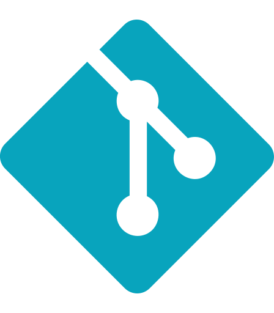

	A creative, detail-oriented, software developer with a deep interest in AI and integrating 3D modeling in web design.

	Quick learner who enjoys experimenting with new technology. Able to switch between perfectionism and pragmatism. Agile
	software development, teamwork, extremely passionate about design. Always willing and able to think outside the box.

 

Please see <a href="https://ameenmohiyuddin.netlify.app/">my website</a> for more information!

 

<!-- PROJECTS -->

<h2 align="center" color="white">Projects</h2>

	<table>
		<tr>
			<td width="50%">
				<h3 align="center" color="white">Marvel Cinematic Universe - Explorer</h2>
				
  
					
					 
					 
					

						  
							
					

					
<strong>JavaScript, CSS3, HTML5</strong> - Platform for Marvel Cinematic Universe fans to find general information about their favorite movies!

				

			</td>
			<td width="50%">
				<h3 align="center" color="white">Nasa's picture of the day archive explorer</h2>
				
  
					
					 
					 
					

						  
							
					

					 
<strong>JavaScript, CSS3, HTML5</strong> - Simple app to help you decide which drinks to make at your party!

				

	<tr>
		<td width="50%">
			<h3 align="center" color="white">Personal Portfolio</h2>
			
  
				
				 
				 
				

					  
						
				

				
<strong>JavaScript, CSS3, HTML5</strong> - Portfolio Site including links to my projects and ways to get in contact with me.

			

		</td>
		<td width="50%">
			<h3 align="center" color="white">Simple Calculator</h2>
			
  
				
				 
				 
				

					  
						
				

				
<strong>JavaScript, CSS3, HTML5</strong> - Simple calculator website as my first attempt to work with OOP.

			
	
		</td>
	</table>

 
 

<!-- TECHNOLOGIES -->
 
<h2 align="center" color="white">Technologies</h2>

<table>
	<tr>
		<td valign="top" width="33.3333%">
			<h3 align="center" color="white">Frontend</h2>
			 
				
  
					
						&nbsp&nbsp&nbsp
					
						&nbsp&nbsp&nbsp
					
						&nbsp&nbsp&nbsp
					  
					

			</td>
			<td valign="top" width="33.3333%">
				<h3 align="center" color="white">Backend</h2>
				 
				

					&nbsp
<<<<<<< HEAD
					  
					&nbsp&nbsp&nbsp					
					
					&nbsp&nbsp&nbsp
					 					 
					&nbsp&nbsp&nbsp
					 
						
=======
					  
					&nbsp&nbsp&nbsp
					 					 
					&nbsp&nbsp&nbsp
					 
					&nbsp&nbsp&nbsp
						
>>>>>>> parent of 4d38a24 (Update README.md)
					 
					 		
				

			</td>
			<td valign="top" width="33.3333%">	
				<h3 align="center" color="white">Other Software</h2>
				 
				

					&nbsp
					  
					&nbsp&nbsp&nbsp
					 
<!-- 					&nbsp&nbsp&nbsp
					  -->
					&nbsp&nbsp&nbsp
					   	
					&nbsp&nbsp&nbsp
					 
				

			</td>
		</tr>
	</table>

 
 
<!-- CONTACT -->

<h2 align="center" color="white">Let's connect!</h2>

	
	&nbsp&nbsp&nbsp
		
	&nbsp&nbsp&nbsp
	
	&nbsp&nbsp&nbsp
	
	&nbsp&nbsp&nbsp
	

